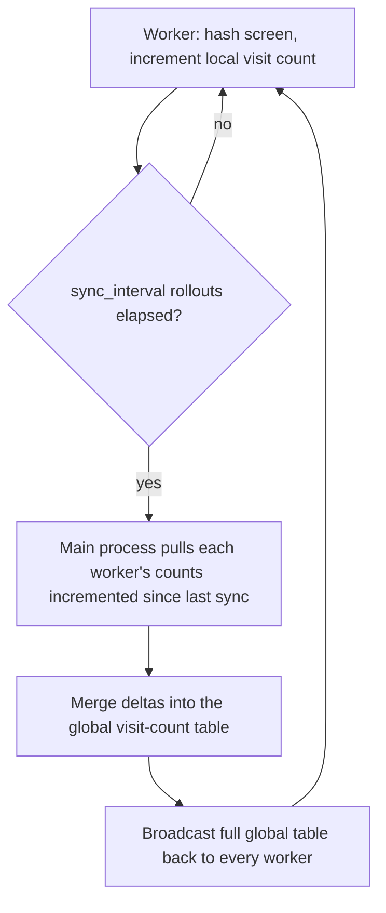

# feat: Persistent Count-Based Exploration Reward

## Summary

This plan replaces `PokemonRedEnv`'s per-episode, pairwise pixel-comparison reward with a persistent, count-based novelty reward: a Go-Explore-style downsample-and-quantize hash maps each screen to a state cell, and a visit-count table - shared across all parallel training workers via periodic merging - drives the reward. It covers the full brainstorm scope in one pass, retires the mechanism being replaced, and adds the project's first automated test coverage for the new logic.

## Problem Frame

The current reward (`pokemon_red_env.py`'s `calculate_fitness`) rebuilds its frame memory from empty on every episode reset and scans it pairwise per step, so it cannot track progress across a training run and its cost grows with the number of distinct states found (see origin: `docs/brainstorms/2026-09-09-persistent-exploration-reward-requirements.md`). The project's exploration philosophy - a finite state space, rewarded until fully found - needs memory that survives the whole training run, not just one episode.

---

## Key Technical Decisions

- **State identity via a downsample-and-quantize screen hash, screen-only (R4).** Follows Go-Explore's cell-definition heuristic (see Sources) rather than a finer perceptual hash or a learned embedding. This trades the collision-risk and coarseness of a downsampled hash for staying RAM-free; Tang et al. found hash granularity, not information source, is the main quality lever, so the imprecision is expected to be tunable rather than fatal.
- **Reward formula is `1/sqrt(visit_count)`, applied after incrementing (R1).** This decays slower than `1/count`, so a state's 2nd-10th visits still carry non-trivial reward instead of collapsing to near-zero immediately - the shape Tang et al. (2017) validated for exactly this state-counting setup, so a custom decay curve isn't justified without evidence this one underperforms.
- **Cross-worker count sharing via periodic local-then-merge, not a per-step shared structure (R3).** `SubprocVecEnv` provides no native shared-state primitive beyond its command pipes to the main process, so a structure updated on every step would add an IPC round trip to every environment step across every worker. `TensorBoardCallback` shows the `env_method`/`get_attr` channel works for one worker (`indices=[0]`) inside `_on_step`; this plan extends it to all workers inside `_on_rollout_end` (currently an empty stub) - new usage this plan introduces, not an already-validated multi-worker pattern, so it needs its own correctness check (see U3). A `multiprocessing.shared_memory`-backed structure was considered as an alternative but rejected: `shared_memory` needs a fixed-size or manually-resized buffer, a poor fit for a dict whose key count grows continuously during exploration, whereas plain dict-based merging handles that growth for free.
- **Sync cadence and payload are decoupled from `n_steps` and from full-table size (R3).** The merge interval is a named, tunable setting (`sync_interval`, in rollouts) independent of PPO's `n_steps`, so it isn't silently pinned to `main.py`'s current `n_steps=episode_length=10`. Each sync's pull direction sends only the counts a worker has incremented since its last sync (a delta), not its entire local table - this bounds the pull payload by recent activity rather than by how many distinct states have been found so far, which is what would otherwise make cost grow unboundedly over a long run. The push direction still broadcasts the full current global table, but that table's size is capped by the game's actual finite state space (the same premise this feature is built on), not by run length.
- **This replaces the existing mechanism outright, with no fallback flag (R5).** `self.memory`, `calculate_fitness`'s pairwise-MSE scan, and `compare_images` (its only caller) are deleted. R5 treats the old path as actively wrong, not merely weaker - keeping it behind a toggle would leave a reward path that rewards stale states available for use, which is worse than no fallback.
- **`pytest` is introduced as the project's first automated test framework.** No test harness exists today. pytest's fixtures and plain-assert style cut the boilerplate the mock-PyBoy fixtures in U2/U3 require, which is worth the one new dependency at this project's current size versus stdlib `unittest`, which would add zero dependencies but more boilerplate.

---

## Requirements

- R1. Reward for a step is derived from a persistent count of how many times the agent's current screen state has been observed, not from comparing the current frame against a list of stored past frames.
- R2. The visit-count state survives across episode boundaries (`env.reset()`) for the life of a training run; it does not reset per episode.
- R3. The visit-count state is shared across all parallel training workers (each running its own PyBoy instance), so a state visited by one worker counts as visited for all workers.
- R4. State identity is derived only from the rendered screen; no emulator memory or RAM read is used to compute or influence the reward.
- R5. The existing per-episode, pairwise pixel-comparison reward path (`self.memory`, `calculate_fitness`'s MSE-based scan, and its distance thresholds) is removed as part of this change, not preserved alongside the new mechanism.

---

## High-Level Technical Design

The cross-worker count sharing (U3, U4) runs as a periodic cycle rather than a per-step round trip:



---

## Output Structure

```
tests/
  test_image_checker.py
  test_pokemon_red_env.py
  test_visit_count_merge.py
```

---

## Implementation Units

### U1. Screen-state hashing utility

- **Goal:** Provide a pure function mapping a raw screen array to a stable, hashable state-cell key, downsampling and quantizing to tolerate animation and menu noise.
- **Requirements:** R4
- **Dependencies:** none
- **Files:** `image_checker.py` (add function), `tests/test_image_checker.py` (new)
- **Approach:** Downsample the grayscale screen array to a small fixed resolution and quantize pixel intensity into a small number of levels, mirroring Go-Explore's cell-definition heuristic (see Sources), then hash the resulting compact array into a dict-suitable key. Keep the downsample resolution and quantization level count as named constants rather than inline magic numbers, so they can be retuned if the hash proves too coarse or too fine once training is observed.
- **Patterns to follow:** `image_checker.py`'s existing `cv2.resize` usage in `compare_images` for interpolation choice. The input here is already single-channel (`PokemonRedEnv._get_obs()` provides a 2D array from `pyboy.screen.ndarray[:, :, 0]`), so no grayscale-conversion step is needed, unlike `compare_images`'s 3-channel branch.
- **Test scenarios:**
  - Happy path: hashing the same frame twice yields the same key.
  - Edge case: two frames differing only in a small region of pixel intensity (simulating tile animation) below the quantization threshold yield the same key.
  - Edge case: two frames representing genuinely different game states (different tile arrangement) yield different keys.
  - Edge case: synthetic all-black and all-white frames both hash without error and yield different keys from each other.
- **Verification:** `tests/test_image_checker.py` passes; the function has no dependency on PyBoy or the environment class, so it runs without a ROM.

### U2. Persistent, hash-driven reward in `PokemonRedEnv`

- **Goal:** Replace `calculate_fitness`'s pixel-comparison logic and `self.memory` with reward computed from the state hash's visit count, without resetting that count on `reset()`.
- **Requirements:** R1, R2, R4, R5
- **Dependencies:** U1
- **Files:** `pokemon_red_env.py`, `tests/test_pokemon_red_env.py` (new)
- **Approach:** On each step, hash the current screen via U1's function, increment a local visit-count table keyed by that hash, and compute reward from the post-increment count. The visit-count table's initial value is read from settings (e.g. `self.visit_counts = settings.get("initial_visit_counts", {})`), defaulting to empty when absent, rather than hardcoded empty - this lets U4 seed it without a follow-up change to U2. It is initialized once in `__init__`, not in `reset()`, so it persists across episodes within a single environment process. `self.memory` and the pairwise-MSE branch in `calculate_fitness` are deleted; `compare_images` is deleted from `image_checker.py` since this was its only caller. The existing per-novel-state screenshot save (`img.save(...)` in `calculate_fitness`) is preserved, but its trigger moves from the deleted MSE-distance check to "this hash's post-increment count equals 1" - a screenshot is still saved the first time a given state cell is seen.
- **Patterns to follow:** the existing `calculate_fitness`/`_get_obs` structure for where reward computation hooks into `step()`.
- **Test seam:** tests construct `PokemonRedEnv` with `unittest.mock.patch("pokemon_red_env.PyBoy")` around the constructor call, so no real ROM or PyBoy instance is created; the mock's `.screen.ndarray` attribute is set to a synthetic frame per test case.
- **Test scenarios:**
  - Happy path: the first-ever visit to a state yields the maximum per-visit reward.
  - Happy path: revisiting the same state within one episode yields a strictly smaller reward than the first visit.
  - Integration: calling `env.step()` end-to-end returns a reward exactly equal to `1/sqrt(count)` for the hash it just incremented.
  - Integration: a state visited in one episode still shows an elevated visit count after `reset()` and a new episode begins, proving the count is not wiped. Covers R2.
  - Integration: the first visit to a new state hash still writes a screenshot to the per-episode image directory; a revisit of that same hash does not write a duplicate.
  - Edge case: visiting many distinct states in sequence keeps the count table correct and raises no error.
  - Regression: `self.memory` and `compare_images` are fully removed, with no leftover references or imports.
- **Verification:** `tests/test_pokemon_red_env.py` passes without requiring the real Pokemon Red ROM, by constructing `PokemonRedEnv` against a stub/mock PyBoy that only needs to exercise hashing and count logic.

### U3. Cross-worker visit-count merge mechanism

- **Goal:** Let visit counts recorded by one training worker become visible to all others, on a periodic cadence rather than every step.
- **Requirements:** R3
- **Dependencies:** U2
- **Files:** `tensorboard_callback.py` (extend, or a new small callback module alongside it), `tests/test_visit_count_merge.py` (new)
- **Approach:** Every `sync_interval` rollouts (a named, tunable setting independent of PPO's `n_steps`), pull each worker's *delta* - the counts it has locally incremented since its last sync - via `env_method`/`get_attr` on the vectorized env, merge those deltas into one global table, then push the full global table back down via `VecEnv.set_attr` so every worker's local table converges on the shared baseline. Sending deltas rather than each worker's full local table on every sync keeps the pull payload bounded by recent activity, not by how many distinct states have been found so far. `TensorBoardCallback`'s `_on_step` already reaches into `SubprocVecEnv` via `env_method`/`get_attr`, but only for worker 0 (`indices=[0]`) inside its truncation check; `_on_rollout_start`/`_on_rollout_end` are currently empty stubs. This unit implements the merge inside `_on_rollout_end`, which is new usage of the channel across all workers, not a reuse of an already-proven multi-worker path. The "global visit-count table" this unit builds is the same conceptual table U4 seeds a worker's `PokemonRedEnv.__init__` with - U4's seed value is this table's state at construction time, not a separate artifact.
- **Patterns to follow:** `tensorboard_callback.py`'s existing `env_method`/`get_attr` usage in `_on_step` for the calling convention, not its worker-0-only scope.
- **Test scenarios:**
  - Happy path: merging two local count deltas with no overlapping keys produces the union of both.
  - Happy path: merging two local count deltas with overlapping keys combines the counts for shared keys correctly.
  - Edge case: merging when one worker's delta is empty leaves the global table unchanged by that worker.
  - Integration: a 2+-worker stub `DummyVecEnv` confirms the merge pulls from and broadcasts to every worker, not just worker 0 - directly guards against the `indices=[0]` narrowing already present in `_on_step`.
  - Integration (real `SubprocVecEnv`): a 2-worker `SubprocVecEnv` wrapping a minimal stub environment (not full PyBoy) confirms a count incremented in one worker's process is visible in the other worker's process after a sync - this is the one test in the plan that exercises the actual cross-process boundary R3 depends on, rather than an in-process stand-in.
- **Verification:** `tests/test_visit_count_merge.py` passes using in-process dicts standing in for worker-local deltas for the merge-logic scenarios, plus the real-`SubprocVecEnv` scenario above for cross-process correctness.

### U4. Wire the shared table into training entry points

- **Goal:** Construct the shared visit-count structure once per training run and thread it through to every parallel environment instance.
- **Requirements:** R3
- **Dependencies:** U2, U3
- **Files:** `main.py`, `test.py`
- **Approach:** Create the shared structure's initial/seed representation once in each entry point before constructing environments, add it to `env_settings`, and pass a picklable copy into each subprocess's `PokemonRedEnv.__init__` via `create_env`. Cross-process consistency after startup comes from U3's periodic merge protocol, not from object identity - under `SubprocVecEnv`, each worker's `env_settings` closure is pickled into a separate process, so no Python object reference is literally shared across workers.
- **Patterns to follow:** the existing `env_settings` dict and `create_env` function in `main.py`, already duplicated into `test.py`.
- **Test scenarios:**
  - Integration (`DummyVecEnv` only): constructing environments via `create_env` gives every environment instance the same initial seed value from the shared structure.
  - Test expectation: none beyond the integration case above for the config-wiring logic itself - `SubprocVecEnv` cross-process correctness is not exercised by unit tests and instead depends on U3's merge protocol, checked by the manual smoke run below.
- **Verification:** manual smoke run (`python main.py`) starts training without raising; this unit's `SubprocVecEnv` correctness depends on the real PyBoy/`SubprocVecEnv` stack that U1-U3's unit tests intentionally stub out.
- **`test.py` scope note:** `test.py`'s `TRAIN_FROM_SCRATCH` path is single-worker (no `SubprocVecEnv`/`DummyVecEnv` wrapper) and is out of scope for R3's cross-worker merge. Only the `env_settings` seed-value wiring - matching this unit's `DummyVecEnv` test scenario - needs to reach `test.py`; the `SubprocVecEnv`/`TensorBoardCallback` merge machinery does not apply there.

---

## Scope Boundaries

**Deferred for later:**
- Random Network Distillation as a fallback if hash-based counting proves insufficient.
- A persistent nearest-neighbor index over frame embeddings.
- Go-Explore's "return to a promising state, then explore from it" step.

**Outside this change:**
- Any reward component derived from emulator memory or game-specific state.
- The existing map-stitching code (`stitching/stitch.py`).
- On-disk persistence of the visit-count table across process restarts. R2/R3's "persistent" scope is the lifetime of one continuous training-run process; it does not cover `main.py`'s commented-out checkpoint-resume path, which isn't a live feature today. If checkpoint-resume is built later, the visit-count table would need to be saved and restored alongside the model at that point - revisit then rather than building speculative persistence infrastructure now.

**Deferred to Follow-Up Work:**
- Reserving CPU headroom in `main.py`'s `NUM_CPU = os.cpu_count()` for the main process now that it also coordinates the shared count table - a tuning concern, not part of this change.
- Empirically tuning the hash's downsample resolution and quantization levels based on observed training behavior - this plan makes them named, adjustable constants (U1) but does not tune them.

---

## Risks & Dependencies

- **Risk:** Miscalibrated hash granularity could reintroduce the animation-fixation failure mode documented in this project's own inspiration, or collapse genuinely distinct states into one key, undercounting real progress. Mitigation: keep the downsample resolution and quantization levels as named, adjustable constants (U1), and treat the growth rate of distinct hashed states over a run as an informal sanity signal.
- **Risk:** Periodic rather than per-step merging (see Key Technical Decisions) means two workers can independently treat the same state as novel within one sync interval, briefly over-rewarding it and each independently writing a screenshot for what is conceptually one first discovery. This is an accepted trade-off for avoiding per-step IPC cost across all workers - the reward effect is bounded and self-correcting after the next sync, and the screenshot duplication is wasted disk space in each worker's own directory, not a correctness bug. Not a defect to fix in this pass.
- **Dependency:** `SubprocVecEnv` exposes no native shared-state primitive beyond command pipes to the main process (confirmed against Stable-Baselines3's source), which is why U3's merge mechanism is necessary infrastructure rather than an incidental detail.
- **Dependency:** This plan adds `pytest` to `requirements.txt` as the project's first test dependency; no other new third-party dependencies are introduced.

---

## Sources / Research

- [Go-Explore: a New Approach for Hard-Exploration Problems](https://arxiv.org/abs/1901.10995) (Ecoffet et al., 2019) - precedent for the downsample-and-quantize cell-definition hash used in U1.
- [#Exploration: A Study of Count-Based Exploration for Deep Reinforcement Learning](https://arxiv.org/abs/1611.04717) (Tang et al., 2017) - precedent for the count-based reward formula and the finding that hash granularity is the main quality lever.
- [Exploration by Random Network Distillation](https://arxiv.org/abs/1810.12894) (Burda et al., 2018) - documented fallback approach if hashing proves insufficient (see Scope Boundaries).
- [Stable-Baselines3 `SubprocVecEnv` source](https://stable-baselines3.readthedocs.io/en/master/_modules/stable_baselines3/common/vec_env/subproc_vec_env.html) - confirms no native cross-worker shared-state primitive exists beyond command pipes, motivating U3.
- `docs/brainstorms/2026-09-09-persistent-exploration-reward-requirements.md` - origin requirements document.
- `tensorboard_callback.py` - the `env_method`/`get_attr` calling convention is reused by U3, but broadcasting/merging across all workers inside `_on_rollout_end` is new usage this plan introduces, not a previously validated multi-worker path.
