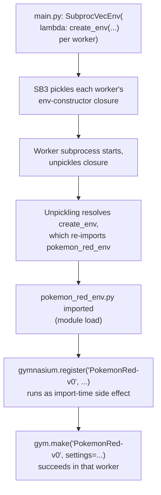

# feat: Exploration-Hash Observability and Gymnasium Registration

## Summary

This plan makes the exploration-reward hash's granularity (downsample resolution, quantization levels) a per-run setting instead of a hardcoded constant, and adds TensorBoard metrics for distinct-state discovery, so a real training run can later inform tuning decisions - it does not pick or commit new tuned values itself. It also registers `PokemonRedEnv` with Gymnasium and switches `main.py`'s `create_env` to construct the environment via `gym.make()`.

## Problem Frame

The roadmap's next two items are "tune exploration-reward hash granularity ... based on observed training behavior" and "register Gymnasium environment to be able to use `gym.make()`" (`README.md:37-38`). Checking those against the current repo state surfaced a gap: no training run has produced data here yet (no `checkpoints/`, `logs/`, or `env_data/` present), `main.py`'s training config is smoke-test scale (`episode_length=10`, `batch_size=2`, `n_epochs=1`, ~400 total env steps), and `tensorboard_callback.py` logs no metric that would let anyone judge whether the hash's `DOWNSAMPLE_SIZE`/`QUANTIZATION_LEVELS` are too coarse or too fine. "Tune based on observed behavior" has nothing to observe yet.

This plan builds that prerequisite instead of guessing at new constants: it makes the hash's granularity a per-run setting and adds the TensorBoard metrics needed to actually observe its effect, so a real, larger-scale training run (outside this plan's scope) can inform the tuning decision afterward. The gym-registration item is mechanically unrelated but was already scoped as similarly cheap, adjacent near-term work, so it's planned alongside it.

---

## Requirements

**Hash configurability and observability**
- R1. `hash_screen_state`'s downsample resolution and quantization level count are read from the environment's settings, not hardcoded module constants, so different values can be used across runs without code changes.
- R2. Existing behavior is unchanged when no override is supplied - default downsample/quantization values match today's `DOWNSAMPLE_SIZE`/`QUANTIZATION_LEVELS`.
- R3. Training logs a running count of distinct states discovered (the global, cross-worker-merged table) to TensorBoard.
- R4. Training logs the number of newly discovered distinct states per sync interval, not only the cumulative total.
- R5. This plan does not select or commit new tuned hash-granularity values - that decision is deferred to a real training run performed separately, using the observability this plan adds.

**Gymnasium registration**
- R6. `PokemonRedEnv` is registered with Gymnasium under a stable env ID so it is constructible via `gym.make()`.
- R7. Registration is effective in every `SubprocVecEnv` worker subprocess, not only the parent process.
- R8. `main.py`'s `create_env` (and therefore `test.py`, which reuses it) constructs the environment via `gym.make()` rather than calling `PokemonRedEnv(...)` directly.
- R9. Switching to `gym.make()` does not change environment behavior relied on elsewhere: direct attribute access via `VecEnv.get_attr`/`set_attr`/`env_method`, the observation/action spaces, and existing worker seeding via `seed + env_id`.

---

## Key Technical Decisions

- **Distinct-state metrics are computed from `TensorBoardCallback.global_visit_counts` inside `_on_rollout_end`, not via `calculate_values`/the per-step `info` dict.** `global_visit_counts` already holds the full merged table after each `sync_visit_counts` call, so `len(...)` before and after that call gives both the cumulative and delta metrics with no new cross-process plumbing. Adding a computed field to `PokemonRedEnv.step`'s `info` dict instead would require per-step (not per-sync) computation and duplicate a table the callback already has.
- **`hash_screen_state` takes downsample size and quantization levels as optional parameters defaulting to the current constants**, rather than deleting the module constants. This keeps the function directly callable at today's default from any call site (including existing tests) without settings plumbing; `PokemonRedEnv` becomes the one production call site that reads the values from `settings` and passes them through explicitly.
- **New `env_settings` keys default to the existing hardcoded values when absent**, in both `main.py` and `test.py`, so behavior is unchanged until someone deliberately overrides them.
- **`gymnasium.register()` runs as a module-level import-time side effect in `pokemon_red_env.py`.** The Gymnasium registry is per-process and does not propagate to `SubprocVecEnv` worker subprocesses. Every worker already re-imports `pokemon_red_env` (directly or transitively through `main.py`) when Stable-Baselines3 unpickles each worker's env-constructor closure, so registering at import time makes every worker register itself for free, with no separate registration call needed at each call site.
- **Registration sets `max_episode_steps=None` and leaves `disable_env_checker` at Gymnasium's own default (`False`).** The env already enforces its own step budget via `max_steps`/`truncated_check()`, so a second `TimeLimit` wrapper would be redundant. `PassiveEnvChecker` only runs once per env instance - on its first `reset()` and first `step()`, then no-ops - so its cost across even many parallel workers is negligible, not a per-step tax. `PokemonRedEnv` has never gone through `gym.make()` before, and `create_env`'s own `check_env` call only runs when `debug=True`, which `main.py`'s real training entry point never sets - so leaving the passive checker on is the only contract validation most real training runs will actually get. Revisit disabling it only after the env has survived a real multi-worker training run (see Scope Boundaries).
- **`create_env` passes the full settings dict as `gym.make("PokemonRed-v0", settings=settings)`.** `PokemonRedEnv.__init__` takes a single `settings` dict argument, and Gymnasium's kwarg merge with `register()`-level defaults is a shallow top-level `dict.update` - relying on `register()`-level defaults for individual settings keys would not deep-merge into an overriding dict. Passing one complete dict at the call site sidesteps that entirely.
- **`sync_visit_counts`'s broadcast step uses `VecEnv.env_method` with a new `PokemonRedEnv.set_visit_counts` method, not `VecEnv.set_attr`.** Verified against the installed library source: Stable-Baselines3's `VecEnv.set_attr` does a plain `setattr` on whatever object each VecEnv slot holds, while `get_attr`/`env_method` resolve through Gymnasium's `Wrapper.get_wrapper_attr`, which traverses wrapper chains. Once `create_env` (U5) returns a `gym.make()`-wrapped env, `set_attr` would set `visit_counts` on the outer wrapper instead of the inner `PokemonRedEnv`, silently breaking the cross-worker reward merge with no exception raised. `env_method` reaches the wrapped instance correctly, matching the existing `pop_visit_count_delta` call already using that path.

---

## High-Level Technical Design

Registration reaching every `SubprocVecEnv` worker depends on import order, not an explicit per-worker call - worth making explicit since it's the one non-obvious sequencing point in this plan:

---

## Implementation Units

### U1. Make `hash_screen_state` configurable

- **Goal:** Downsample size and quantization levels become optional arguments with today's values as defaults.
- **Requirements:** R1, R2
- **Dependencies:** none
- **Files:** `image_checker.py`, `tests/test_image_checker.py`
- **Approach:** Add `downsample_size` and `quantization_levels` parameters to `hash_screen_state`, defaulting to the existing `DOWNSAMPLE_SIZE`/`QUANTIZATION_LEVELS` module constants (kept, not deleted), so existing bare calls are unaffected. Update the comment at `tests/test_image_checker.py:26`, which currently hardcodes reasoning about `QUANTIZATION_LEVELS=8`, so it doesn't go stale once the value is overridable.
- **Patterns to follow:** the existing `cv2.resize`/quantization logic in `hash_screen_state`.
- **Test scenarios:**
  - Happy path: calling with no overrides produces the same hash as before the change (regression against current default behavior).
  - Happy path: overriding `downsample_size` to a different resolution changes the hash for a frame pair that collided at the default resolution.
  - Happy path: overriding `quantization_levels` to a coarser value collapses two frames that differ only in a small pixel-intensity region into one hash, at a granularity the default wouldn't.
  - Edge case: `quantization_levels=1` (maximally coarse) still returns a valid hashable key without error.
- **Verification:** `tests/test_image_checker.py` passes with the new parametrized cases alongside the existing ones.

### U2. Wire hash config through `PokemonRedEnv` settings

- **Goal:** `PokemonRedEnv` reads hash downsample/quantization overrides from settings and passes them into `hash_screen_state` at its one production call site.
- **Requirements:** R1, R2
- **Dependencies:** U1
- **Files:** `pokemon_red_env.py`, `tests/test_pokemon_red_env.py`, `main.py`, `test.py`
- **Approach:** `PokemonRedEnv.__init__` reads the two new keys via `settings.get(...)`, defaulting to `image_checker`'s constants (imported, not redefined), stores them on `self`, and `calculate_fitness` passes them into its `hash_screen_state` call. Add the two new keys to both `env_settings` dicts in `main.py` and `test.py`, defaulted to today's values so behavior is unchanged until overridden.
- **Patterns to follow:** the existing `settings.get("initial_visit_counts", {})` pattern already used in `__init__`.
- **Test scenarios:**
  - Happy path: constructing `PokemonRedEnv` without the new settings keys behaves identically to today for a given frame.
  - Happy path: constructing `PokemonRedEnv` with overridden hash settings changes `calculate_fitness`'s reward/visit-count behavior for a frame pair that would otherwise collide, or not collide, at the default granularity.
  - Regression: existing `tests/test_pokemon_red_env.py` scenarios (first-visit reward, revisit reward, reset persistence) keep passing unmodified with the new settings keys absent.
- **Verification:** `tests/test_pokemon_red_env.py` passes; `tests/test_wire_entry_points.py` confirms `main.py`/`test.py`'s `env_settings` dicts still construct a working environment.

### U3. Log distinct-state discovery metrics to TensorBoard

- **Goal:** Expose the exploration hash's practical effect - how many distinct states have been found, and how fast new ones are appearing - as TensorBoard metrics, so hash granularity can later be judged against real training data.
- **Requirements:** R3, R4
- **Dependencies:** none
- **Files:** `tensorboard_callback.py`, a test file covering the new metric logic (new `tests/test_tensorboard_metrics.py`, or an extension of `tests/test_visit_count_merge.py` if that reads more naturally at implementation time)
- **Approach:** In `_on_rollout_end`, capture `len(self.global_visit_counts)` before calling `sync_visit_counts`, then after the call record the new length as a cumulative "distinct states" metric via `self.logger.record`, and the difference from the pre-sync length as a "newly discovered this sync" metric. Computing the pre-sync length before the call keeps the delta accurate even when `sync_visit_counts` short-circuits (no worker had anything new to report).
- **Patterns to follow:** the `self.logger.record(f"env_stats/...", val)` usage already present in `_on_step`.
- **Test scenarios:**
  - Happy path: a sync round that adds newly seen states logs a cumulative count matching the merged table's size and a delta matching the number of new keys added.
  - Edge case: a sync round where `sync_visit_counts` short-circuits (all worker deltas empty) logs a delta of zero and an unchanged cumulative count.
  - Integration: a 2+-worker stub `DummyVecEnv` (mirroring `tests/test_visit_count_merge.py`'s `StubCountEnv`) run across two `_on_rollout_end` calls shows the cumulative metric growing monotonically and the delta metric reflecting genuinely new keys, not double-counted revisits.
- **Verification:** the new/extended test file passes without a real ROM, using the existing stub-env pattern.

### U4. Register `PokemonRedEnv` with Gymnasium

- **Goal:** `PokemonRedEnv` is constructible via `gym.make()`, including from inside `SubprocVecEnv` worker subprocesses.
- **Requirements:** R6, R7
- **Dependencies:** none
- **Files:** `pokemon_red_env.py`
- **Approach:** Call `gymnasium.register(id="PokemonRed-v0", entry_point="pokemon_red_env:PokemonRedEnv", max_episode_steps=None)` at module level - leaving `disable_env_checker` at Gymnasium's default (`False`) rather than opting out of it - guarded so repeated import within the same process doesn't raise a duplicate-registration error (e.g. skip the call if the ID is already registered).
- **Patterns to follow:** none existing in-repo - this is new API surface (see Sources).
- **Test scenarios:**
  - Happy path: after importing `pokemon_red_env`, `gym.make("PokemonRed-v0", settings=<valid settings dict>)` returns a working `PokemonRedEnv` instance (mocked PyBoy).
  - Edge case: importing `pokemon_red_env` twice in the same process does not raise a duplicate-registration error.
  - Regression: constructing `PokemonRedEnv(settings=...)` directly still works unchanged.
- **Verification:** a new or extended test (e.g. `tests/test_gym_registration.py`) exercises `gym.make()` against a mocked PyBoy, matching the mocking pattern already used elsewhere.

### U5. Switch `create_env` to construct via `gym.make()`

- **Goal:** `main.py`'s `create_env` (and, transitively, `test.py`) uses the registered env ID as the real construction path.
- **Requirements:** R8, R9
- **Dependencies:** U4, U6
- **Files:** `main.py`
- **Approach:** Replace the direct `PokemonRedEnv(settings=settings)` call in `create_env` with `gym.make("PokemonRed-v0", settings=settings)`. Import `gymnasium as gym` and keep a plain `import pokemon_red_env` (not `from pokemon_red_env import PokemonRedEnv`) so U4's registration side effect still runs, since the class itself is no longer referenced directly. Change the subsequent reset call to `env.reset(seed=seed + env_id)`: Gymnasium 1.3.0's `Env.reset`/`Wrapper.reset` declare `seed` keyword-only, so the existing positional `env.reset(seed + env_id)` would raise `TypeError` once `create_env` returns a `gym.make()`-wrapped env. Leave the debug-gated `check_env` call unchanged. This unit depends on U6 landing first so the write side of `sync_visit_counts` is already fixed before `create_env` starts handing out wrapped envs.
- **Patterns to follow:** the existing `create_env` structure; `test.py` needs no direct change since it only calls `create_env` via `from main import create_env`.
- **Test scenarios:**
  - Happy path: `create_env(env_settings)` returns an env whose observation/action spaces and `reset()` behavior match today's direct-construction path (mocked PyBoy).
  - Regression: `create_env`'s `env.reset(seed=...)` call succeeds without a `TypeError`, since Gymnasium 1.3.0's wrapper chain (`OrderEnforcing`/`PassiveEnvChecker`) declares `seed` keyword-only.
  - Integration: `tests/test_wire_entry_points.py`'s existing `DummyVecEnv`-based scenario (seed wiring, `initial_visit_counts` seeding) still passes with `create_env` going through `gym.make()`.
  - Regression: worker-facing attribute access relied on elsewhere (`VecEnv.get_attr("visit_counts")`, `env_method("pop_visit_count_delta")`, and U6's `env_method("set_visit_counts", ...)`) still works against a `gym.make()`-constructed env, since SB3's `get_attr`/`env_method` explicitly call `get_wrapper_attr`, which traverses the wrapper chain - unlike plain instance attribute access (`env.visit_counts`), which does not forward through a `gym.make()` wrapper and must go through `.unwrapped` or `get_wrapper_attr` instead (see Risks & Dependencies).
- **Verification:** `tests/test_wire_entry_points.py` and `tests/test_visit_count_merge.py`'s `SubprocVecEnv` scenario both pass with `create_env`'s new construction path. A manual smoke run of `main.py` needs the real ROM and is out of scope for automated tests - run it separately as the final check.

### U6. Fix `sync_visit_counts`'s write path for wrapped environments

- **Goal:** Cross-worker visit-count broadcasts correctly reach the wrapped `PokemonRedEnv` instance once `create_env` (U5) returns a `gym.make()`-wrapped env, instead of silently shadowing an attribute on the outer wrapper.
- **Requirements:** R9
- **Dependencies:** U4
- **Files:** `pokemon_red_env.py`, `tensorboard_callback.py`, `tests/test_visit_count_merge.py`
- **Approach:** Add a `set_visit_counts(self, counts)` method to `PokemonRedEnv` that reassigns `self.visit_counts`. Change `sync_visit_counts`'s broadcast from `vec_env.set_attr("visit_counts", Counter(merged), indices=[i])` to `vec_env.env_method("set_visit_counts", Counter(merged), indices=[i])`, since `env_method` resolves through `Wrapper.get_wrapper_attr` and reaches the wrapped instance, unlike `set_attr`'s plain `setattr`, which only sets an attribute on whatever object is stored in the `VecEnv` slot.
- **Patterns to follow:** the existing `env_method("pop_visit_count_delta")` call already in `sync_visit_counts`, which already uses the correctly-forwarding path.
- **Test scenarios:**
  - Regression: existing `tests/test_visit_count_merge.py` scenarios (merge logic, `DummyVecEnv`/`SubprocVecEnv` sync) still pass with the new write mechanism.
  - Integration: wrap a stub env in a real Gymnasium wrapper inside a `DummyVecEnv` and confirm `sync_visit_counts`'s broadcast lands on the inner env's `visit_counts`, not shadowed on the outer wrapper - this is the scenario that would have caught the bug this unit fixes.
  - Regression: unwrapped stub envs (no `gym.make()` wrapper) still receive the broadcast correctly via the new `env_method` path.
- **Verification:** `tests/test_visit_count_merge.py` passes, including the new wrapped-env scenario.

---

## Scope Boundaries

**Deferred to Follow-Up Work:**
- Picking and committing final `DOWNSAMPLE_SIZE`/`QUANTIZATION_LEVELS` values - needs a real, non-smoke-scale training run using the observability this plan adds; the user's manual follow-up.
- Scaling `main.py`'s training config (`episode_length`, `batch_size`, `n_epochs`, `total_timesteps`) up from smoke-test to real-training scale.
- Resolving whether the later map-stitching/area-identification reward eventually replaces or augments the hash-based count reward.
- Flipping `disable_env_checker` to `True` at registration, once `PokemonRedEnv` has proven itself under a real multi-worker training run through `gym.make()` - not done now since the env has no at-scale run history yet.

**Outside this change:**
- The map-stitching/area-identification/reward-adjustment chain, video recording, and CNN policy optimization roadmap items.

---

## Risks & Dependencies

- **Risk:** the duplicate-registration guard in U4 (skip `register()` if the ID is already registered) is a defensive pattern not explicitly documented by Gymnasium's own tutorial. Mitigation: U4's test scenarios cover importing the module twice in-process directly.
- **Risk:** `create_env`'s manual `check_env` call does not actually run during real training today, since `debug` is never set to `True` in `main.py`'s training entry point - `PassiveEnvChecker` (left enabled per the updated registration decision) is therefore the only contract validation most real runs get until the env has proven itself at scale. Mitigation: keep `disable_env_checker` at its default for now; only disable it after a successful real multi-worker run (see Scope Boundaries). If `PassiveEnvChecker` rejects `PokemonRedEnv`'s `Dict` observation/action space on that first real run, the immediate unblock is setting `disable_env_checker=True` at registration and filing a follow-up to fix or document the space contract - a clean first run is not a precondition for getting past the checker at all.
- **Risk:** the U3 discovery-rate metric's temporal resolution is bounded by `sync_visit_counts`'s sync cadence, defined in the prior persistent-exploration-reward plan, not this one. If syncing is infrequent relative to rollout length, the delta metric can read near-zero for stretches that reflect sync timing, not genuine exploration stalling. Mitigation: when interpreting this metric for the deferred tuning decision (R5), treat the delta as sync-cadence-quantized rather than real-time, and confirm `sync_interval` is tight enough to distinguish granularity-too-coarse from granularity-too-fine before drawing conclusions from it.
- **Dependency:** U3 and U6 assume `tensorboard_callback.py`'s `sync_visit_counts`/`global_visit_counts` behavior from the prior persistent-exploration-reward plan is unchanged; if that mechanism moves in a future change, their integration points need to move with it.
- **Risk (discovered during implementation):** plain instance attribute access (`env.visit_counts`) does not forward through Gymnasium's `gym.make()` wrapper chain - verified empirically against the installed library: only `get_wrapper_attr()` (used internally by SB3's `get_attr`/`env_method`) traverses wrappers; ordinary `.` attribute access on a wrapped object raises `AttributeError` for any attribute not defined on the wrapper itself. This broke `tests/test_wire_entry_points.py`'s direct `env.visit_counts` reads once `create_env` (U5) started returning wrapped envs. Mitigation: any code reading `PokemonRedEnv`-specific attributes off a `gym.make()`-constructed env must go through `.unwrapped` or `get_wrapper_attr()`, not plain attribute access - applied in the affected test.

---

## Sources / Research

- [Gymnasium registry docs](https://gymnasium.farama.org/api/registry/) and `gymnasium.envs.registration` source - `register()`/`make()` signatures and the shallow top-level `dict.update` kwarg-merge behavior behind KTD6.
- [DLR-RM/stable-baselines3 issue #1869](https://github.com/DLR-RM/stable-baselines3/issues/1869) - confirms the Gymnasium registry is per-process, motivating U4's import-time registration approach.
- [`gymnasium.wrappers.common.PassiveEnvChecker` source](https://github.com/Farama-Foundation/Gymnasium/blob/main/gymnasium/wrappers/common.py) - confirms the checker runs once per env instance (first `reset`/`step`, then no-ops), not per step, which is why this plan leaves it enabled by default rather than disabling it for a not-yet-battle-tested env.
- `docs/plans/2026-09-09-001-feat-persistent-exploration-reward-plan.md` - its "Deferred to Follow-Up Work" section already named hash-constant tuning as the next step; this plan builds the observability/configurability prerequisite for that follow-on.
- Installed `gymnasium` (1.3.0) and `stable-baselines3` (2.9.0) source, inspected directly - `Env.reset`/`Wrapper.reset` declare `seed` keyword-only (behind U5's reset-call fix), and `VecEnv.set_attr` uses a plain `setattr` while `get_attr`/`env_method` resolve through `Wrapper.get_wrapper_attr` (behind U6's write-path fix).
